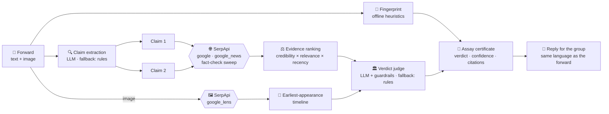

<div align="center">

# कसौटी Kasauti

**The touchstone for WhatsApp forwards.**

*In India, gold is tested by streaking it across a kasauti — a black touchstone.
Kasauti does the same for the messages in your family group: streak any forward
across live evidence from the entire web, and read the mark.*

`Check karo, phir forward karo.` · *Verify before you amplify.*

[](#-tests)
[](#-quickstart)
[](https://serpapi.com)
[](LICENSE)

**SerpApi India Hackathon 2026 · Track: Knowledge & Public Interest (news literacy)**

</div>

---

## The problem

India is the world's largest WhatsApp market, and the family group is where
misinformation lives its best life: the UNESCO "best national anthem" award
that never existed, free-recharge phishing links dressed up as government
schemes, miracle cures "doctors don't want you to know", and — most common of
all — **real photos from old tragedies recycled as today's news**.

Fact-checkers debunk these daily. But their work sits on websites, while the
hoax sits in your pocket, twelve forwards deep, in Hinglish, demanding to be
sent to ten more groups. The gap between *the debunk exists* and *your uncle
sees the debunk* is where Kasauti lives.

## What Kasauti does

Paste a forward (text, image, or both — Hindi, Hinglish, English, sab chalega).
Kasauti runs a six-stage verification pipeline and returns an **assay
certificate**: a verdict, calibrated confidence, credibility-ranked evidence
with links — and a polite, ready-to-paste reply for the group.

| Stage | What happens |
|---|---|
| 🫆 **Forward Fingerprint** | Instant, offline heuristics score the message 0–100 on chain-forward markers: forwarding pleas, "media won't show this", miracle cures, free-gift bait, emoji storms — in English, Hinglish *and* Devanagari. |
| 🔍 **Claim extraction** | An LLM splits the forward into atomic, checkable claims and drafts diverse search queries (rule-based fallback works with no LLM at all). |
| 🌐 **Evidence retrieval** | Four retrieval strategies on three SerpApi engines, in parallel — see [the SerpApi section](#-how-kasauti-uses-serpapi). |
| ⚖️ **Credibility weighting** | Every result is scored by a transparent [source registry](src/kasauti/sources.py): fact-check desks (Alt News, BOOM, Factly, Vishvas News…) and official domains (PIB, `*.gov.in`) outrank ordinary sites; unknown blogs count for little; satire sites get flagged as satire. |
| 🏛️ **Verdict + guardrails** | An LLM judge reads the numbered evidence table — then deterministic guardrails cap what it may claim: no citations → *unverified*; only unknown sources → confidence capped; "definitively false/true" above 80% requires a fact-checker or official source. The model is never allowed to be more confident than the evidence. |
| 📱 **Reply for the group** | The hardest part of fact-checking is telling your uncle. Kasauti drafts a warm, non-preachy correction *in the language of the forward*, receipts attached. |

And the feature that catches the biggest lie category of all:

> 🖼️ **Old-photo detection.** Attach an image URL and Kasauti runs it through
> **Google Lens via SerpApi**, maps the image's other lives across the web
> (dated appearances *and* the years its match titles keep citing), and tells
> you the "cyclone hitting the coast RIGHT NOW" is actually the 2004 tsunami.

## 🚀 Quickstart

```bash
git clone https://github.com/SaudSatopay/kasauti && cd kasauti
python -m venv .venv && .venv\Scripts\activate    # Windows
# python -m venv .venv && source .venv/bin/activate  # macOS/Linux
pip install -e .

cp .env.example .env    # then put your SERPAPI_API_KEY inside
```

The **only required key** is a free SerpApi key
([250 searches/month](https://serpapi.com/pricing)). An LLM key is optional
but recommended — any one of `GEMINI_API_KEY` (free tier), `OPENAI_API_KEY`,
`ANTHROPIC_API_KEY`, `GROQ_API_KEY`, or local Ollama
(`KASAUTI_OLLAMA_MODEL=llama3.2`). No LLM key? Kasauti runs in a conservative
rule-based mode.

**Web app** (the full experience):

```bash
kasauti serve
# → http://127.0.0.1:7860
```

**CLI:**

```bash
kasauti check "UNESCO ne hamare national anthem ko best declare kiya! Forward to every Indian!"

kasauti check "Shocking visuals from yesterday's floods!" --image https://example.com/photo.jpg

kasauti examples          # bundled classic hoaxes to try
kasauti check "..." --json   # full machine-readable report
```

**As a library:**

```python
from kasauti import check

report = check("Modi sarkar de rahi hai FREE recharge, click karo!")
print(report.overall_label)        # VerdictLabel.FALSE
print(report.suggested_reply)      # paste-ready correction, in Hinglish
```

**As an MCP server** — give *any* AI assistant a fact-checking tool:

```bash
pip install -e ".[mcp]"
kasauti mcp
```

```jsonc
// Claude Desktop / any MCP client
{ "mcpServers": { "kasauti": { "command": "kasauti", "args": ["mcp"],
    "env": { "SERPAPI_API_KEY": "…" } } } }
```

## 🔎 How Kasauti uses SerpApi

SerpApi is not an add-on here — it is the evidence engine. Every fact the
verdict cites was retrieved live through it. Four strategies, three engines:

| # | Engine | Strategy | Why it's essential |
|---|--------|----------|--------------------|
| 1 | `google` | Organic web results per claim, `google_domain=google.co.in`, `gl=in` | The broad picture: is anyone credible reporting this at all? India-localised so regional coverage surfaces. |
| 2 | `google_news` | News-tab coverage per claim | Freshness and provenance: real events leave a news trail within hours; hoaxes leave a trail of debunks. |
| 3 | `google` | One query swept across 8 Indian fact-check desks with `site:` operators (`altnews.in`, `boomlive.in`, `factly.in`, `vishvasnews.com`, `pib.gov.in`, …) | The decisive shot: if a dedicated desk has already checked this exact claim, that finding should settle the verdict — and it usually has. |
| 4 | `google_lens` | Reverse image search on attached photos | The single biggest misinformation pattern in India is a real photo with a false caption. Lens finds the image's other lives; dated matches expose the recycling. |

Search results arrive as structured JSON — titles, links, sources, dates —
which is exactly what a credibility-weighting pipeline needs. No scraping, no
brittle parsers, no CAPTCHAs: the whole evidence layer is
[one clean module](src/kasauti/serp.py).

**Free-tier economics** (250 searches/month):

```
one text check   = claims (≤2 by default) × 3 strategies      ≈ 3–6 searches
one image check  = + 1 Google Lens search                     ≈ 4–7 searches
                                              → ~40–80 checks per month, free
```

A transparent budget counter is printed on every certificate
("`4 SerpApi searches`"), responses are disk-cached during development
(22 h TTL, configurable), and the test suite runs entirely on bundled fixtures
— **zero credits to develop, test, or CI**.

## 🏗️ Architecture



Design decisions worth judging:

- **Guardrails over vibes.** The LLM proposes; deterministic code disposes.
  Confidence caps are enforced *after* the model answers, in
  [`verdict.py`](src/kasauti/verdict.py) — an uncited verdict is always
  downgraded to *unverified*, whatever the model felt about it.
- **Old fact-checks stay decisive.** Recency boosts ordinary news but never
  penalises fact-checkers or official sources — a 2023 debunk of a recycled
  2016 hoax is exactly the evidence you want in 2026.
- **Degrades gracefully.** No LLM → rule-based claims and verdicts. No API key
  → helpful error with the free-key link. Broken progress listener → the check
  still completes.
- **Every interface is the same pipeline**: web UI, CLI, Python API, MCP
  server. One `check()` function, four doors.

## 🏷️ Verdict labels

`TRUE` · `MOSTLY TRUE` · `MISLEADING` · `FALSE` · `OUTDATED` (real once,
recycled as current — the WhatsApp classic) · `UNVERIFIED` · `SATIRE`
(sometimes the forward is a Faking News post taken literally).

**What Kasauti is not:** an oracle. It is an evidence *assistant* — every
verdict links its sources, confidence is calibrated to source quality, and the
certificate says, on every run: *"Kasauti assists your judgement — read the
evidence."* When evidence is thin it says *unverified*, not a guess.

## 🧪 Tests

```bash
pip install -e ".[dev]"
pytest
```

56 tests cover the fingerprint heuristics (English + Hinglish + Devanagari),
source tiering, date parsing for every format SerpApi emits, dedup and
ranking, verdict guardrails, both fallback paths, the streaming API, and two
end-to-end pipeline runs — all against bundled SerpApi-shaped fixtures:
**no network, no keys, no credits**. CI runs them on Python 3.10 and 3.12.

## 📂 Project layout

```
src/kasauti/
├── pipeline.py      # the six-stage orchestrator (start here)
├── serp.py          # SerpApi layer: 4 strategies, cache, budget counter
├── fingerprint.py   # offline chain-forward heuristics (en/hi/Hinglish)
├── claims.py        # LLM claim extraction + rule-based fallback
├── evidence.py      # normalise · dedupe · credibility-rank · date parsing
├── sources.py       # the transparent source-credibility registry
├── imagecheck.py    # Google Lens → earliest-appearance timeline
├── verdict.py       # LLM judge + deterministic guardrails + rule fallback
├── reply.py         # the "tell your uncle nicely" generator
├── llm.py           # any OpenAI-compatible provider, or none
├── cli.py · server.py · mcp_server.py · webui/
├── fixtures/        # SerpApi-shaped responses for tests & offline demo
└── examples/        # classic Indian hoaxes to try
```

## 🎬 Demo

Run `kasauti serve`, click the **UNESCO anthem 'award'** chip, and press
*Test it on the stone*. See [docs/demo-video-script.md](docs/demo-video-script.md)
for the 3-minute walkthrough used in the submission video.

## 🏆 Hackathon notes

- **Event:** [SerpApi India Hackathon 2026](https://serpapi.github.io/serpapi-india-hackathon-2026/)
- **Track:** Knowledge & Public Interest — news literacy
- **SerpApi products used:** Google Search API, Google News API, Google Lens
  API (see [How Kasauti uses SerpApi](#-how-kasauti-uses-serpapi))
- **Prior existence:** built from scratch for this hackathon.
- **AI disclosure:** developed with AI pair-programming assistance
  (Claude Code); at runtime, users may optionally configure an LLM of their
  choice for claim extraction and verdict synthesis, as documented above. All
  verdict logic, guardrails and the source registry are deterministic,
  reviewable code.

## 🗺️ Roadmap

- WhatsApp Business API bot — forward a message *to* Kasauti, get the
  certificate back in-chat
- More Indic languages in the fingerprint rules (Tamil, Telugu, Bengali)
- Video thumbnail checks via SerpApi's YouTube engine
- Community-maintained source registry with regional fact-checkers

## License

[MIT](LICENSE). The source registry categorises publishers by *type*
(fact-checker / official / news / satire); it encodes no judgement of any
outlet's editorial stance.
