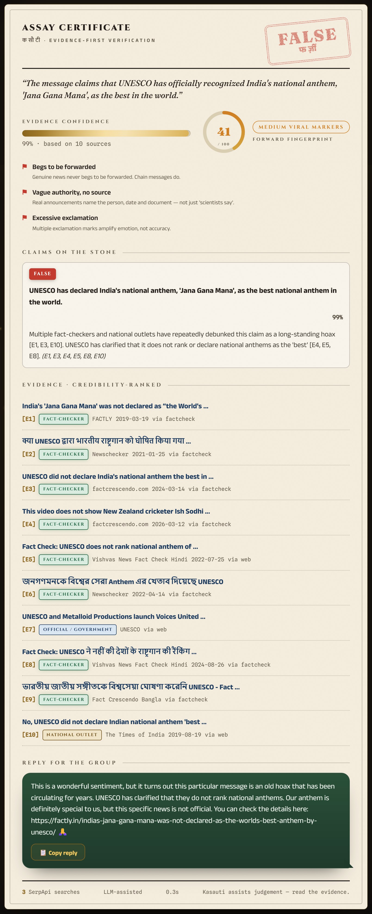
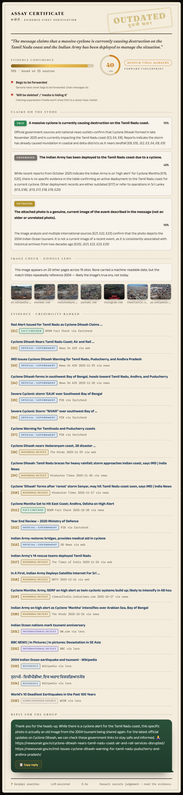
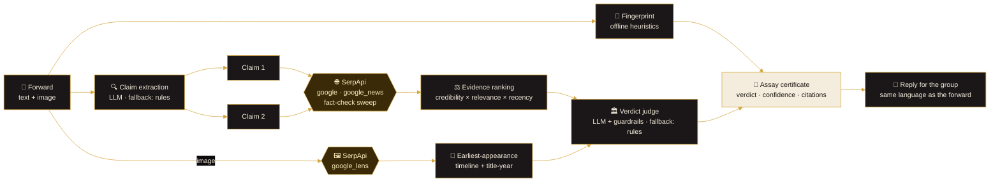
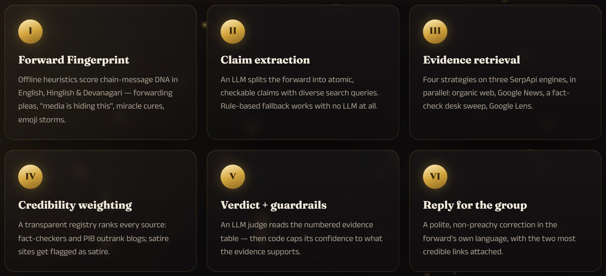
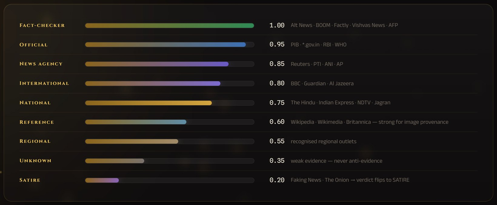

<div align="center">



### The touchstone for WhatsApp forwards.

*In India, gold is tested by streaking it across a **kasauti** — a black touchstone.*
*Kasauti does the same to the messages in your family group: streak any forward across live evidence from the entire web, and read the mark.*

**`Check karo, phir forward karo.`** · *Verify before you amplify.*

<br>

[](#-tests)
[](https://github.com/SaudSatopay/kasauti/actions)
[](#-quickstart)
[](https://serpapi.com)
[](LICENSE)

**SerpApi India Hackathon 2026 · Track: Knowledge & Public Interest (news literacy)**

<sub>[The problem](#-the-problem) · [What it does](#-what-kasauti-does) · [Quickstart](#-quickstart) · [SerpApi usage](#-how-kasauti-uses-serpapi) · [Architecture](#%EF%B8%8F-architecture) · [Guardrails](#%EF%B8%8F-guardrails) · [Four doors](#-four-doors-one-pipeline) · [Tests](#-tests) · [Hackathon notes](#-hackathon-notes)</sub>


</div>

<table align="center" border="0" cellpadding="0" cellspacing="0">
<tr>
<td width="46%" valign="middle">

</td>
<td width="54%" valign="middle">

**Paste a forward. Watch it get assayed.**

- 🫆 **Forward Fingerprint** — offline heuristics catch chain-message DNA in English, Hinglish *and* Devanagari
- 🌐 **Live evidence via SerpApi** — Google Search, Google News, a sweep of 8 Indian fact-check desks, Google Lens
- ⚖️ **Credibility-weighted** — Alt News, BOOM, PIB outrank blogs; satire gets flagged as satire
- 🏛️ **Guarded verdicts** — the LLM proposes, deterministic code caps what it may claim
- 🖼️ **Old-photo detection** — "yesterday's floods" turns out to be the 2004 tsunami
- 📱 **A reply you can actually send** — warm, receipts attached, in the forward's own language

</td>
</tr>
</table>

<br>

## 🇮🇳 The problem

India is the world's largest WhatsApp market, and the family group is where misinformation lives its best life: the UNESCO "best national anthem" award that never existed, free-recharge phishing links dressed up as government schemes, miracle cures "doctors don't want you to know", and — most common of all — **real photos from old tragedies recycled as today's news**.

Fact-checkers debunk these daily. But their work sits on websites, while the hoax sits in your pocket, twelve forwards deep, in Hinglish, demanding to be sent to ten more groups. **The gap between *the debunk exists* and *your uncle sees the debunk* is where Kasauti lives.**

## ✨ What Kasauti does

Paste a forward (text, image URL, or both — Hindi, Hinglish, English, sab chalega). Kasauti runs a six-stage verification pipeline and returns an **assay certificate**: a verdict, calibrated confidence, credibility-ranked evidence with links — and a polite, ready-to-paste reply for the group.

<p align="center">

</p>

| Stage | What happens |
|:--|:--|
| 🫆 **Forward Fingerprint** | Instant, offline heuristics score the message 0–100 on chain-forward markers: forwarding pleas, "media is hiding this", miracle cures, free-gift bait, emoji storms — in English, Hinglish *and* Devanagari. |
| 🔍 **Claim extraction** | An LLM splits the forward into atomic, checkable claims and drafts diverse search queries. A rule-based fallback works with **no LLM at all**. |
| 🌐 **Evidence retrieval** | Four retrieval strategies on three SerpApi engines, in parallel — see [How Kasauti uses SerpApi](#-how-kasauti-uses-serpapi). |
| ⚖️ **Credibility weighting** | Every result is scored by a transparent [source registry](src/kasauti/sources.py): fact-check desks (Alt News, BOOM, Factly, Vishvas News…) and official domains (PIB, `*.gov.in`) outrank ordinary sites; unknown blogs count for little; satire sites get flagged as satire. |
| 🏛️ **Verdict + guardrails** | An LLM judge reads the numbered evidence table — then deterministic guardrails cap what it may claim. **The model is never allowed to be more confident than the evidence.** |
| 📱 **Reply for the group** | The hardest part of fact-checking is telling your uncle. Kasauti drafts a warm, non-preachy correction *in the language of the forward*, receipts attached. |

> ### 🖼️ Real photo. Fake caption.
> The single biggest misinformation format in India isn't fabricated images — it's genuine photos relabelled as breaking news. Attach an image URL and Kasauti runs it through **Google Lens via SerpApi**, maps the image's other lives across the web, and reads the years its match titles keep citing even when no page carries a machine-readable date.
>
> A forward with a photo always carries one more claim — *"this photo genuinely shows the event described"* — judged on the Lens evidence alone. So a true caption on a recycled photo still comes back **OUTDATED**: the cyclone below is real; the photo is the 2004 tsunami.
>
> 

## 🚀 Quickstart

```bash
git clone https://github.com/SaudSatopay/kasauti && cd kasauti
python -m venv .venv && .venv\Scripts\activate      # Windows
# python -m venv .venv && source .venv/bin/activate   # macOS / Linux
pip install -e .

cp .env.example .env     # put your SERPAPI_API_KEY inside
kasauti serve            # → http://127.0.0.1:7860  (landing)  ·  /app  (the checker)
```

The **only required key** is a free SerpApi key ([250 searches/month](https://serpapi.com/pricing)). An LLM key is optional but recommended — any one of `GEMINI_API_KEY`, `OPENAI_API_KEY`, `ANTHROPIC_API_KEY`, `GROQ_API_KEY`, or a local Ollama model (`KASAUTI_OLLAMA_MODEL=llama3.2`). With no LLM key, Kasauti runs in a conservative rule-based mode.

<details>
<summary><b>Free-tier tips (worth reading before a demo)</b></summary>

- Gemini's free tier caps some models at a **handful of requests per day** (e.g. `gemini-2.5-flash` → 20/day on new keys). One check makes 3–4 LLM calls. Set `KASAUTI_LLM_MODEL=gemini-3-flash-preview` (fast, separate quota) or use another provider.
- Kasauti **disk-caches both SerpApi and LLM responses** — run each demo once to warm the cache and every re-run is instant and costs nothing.
- Gemini "thinking" mode is turned off by default (`KASAUTI_GEMINI_THINKING=none`): it added 30–60 s per call with no accuracy gain here.
- Every certificate prints its own cost line: *"3 SerpApi searches · LLM-assisted · 5.4 s"*.
</details>

## 🔎 How Kasauti uses SerpApi

SerpApi is not an add-on here — **it is the evidence engine.** Every fact the verdict cites was retrieved live through it. Four strategies, three engines:

| # | Engine | Strategy | Why it's essential |
|:-:|:--|:--|:--|
| 1 | `google` | Organic web results per claim — `google_domain=google.co.in`, `gl=in` | The broad picture: is anyone credible reporting this at all? India-localised so regional coverage surfaces. |
| 2 | `google_news` | News-tab coverage per claim | Freshness and provenance: real events leave a news trail within hours; hoaxes leave a trail of debunks. |
| 3 | `google` + `site:` | One query swept across 8 Indian fact-check desks — `altnews.in`, `boomlive.in`, `factly.in`, `vishvasnews.com`, `newschecker.in`, `factcrescendo.com`, `factcheck.afp.com`, `pib.gov.in` | The decisive shot: if a dedicated desk has already checked this exact claim, that finding should settle the verdict — and it usually has. |
| 4 | `google_lens` | Reverse image search on attached photos (`type=visual_matches`) | The biggest misinformation pattern in India is a real photo with a false caption. Lens finds the image's other lives; dated matches and title-years expose the recycling. |

Search results arrive as structured JSON — titles, links, sources, dates — exactly what a credibility-weighting pipeline needs. No scraping, no brittle parsers, no CAPTCHAs: the whole evidence layer is [one clean module](src/kasauti/serp.py).

**Free-tier economics** (250 searches/month):

```
one text check   = claims (≤2 by default) × 3 strategies      ≈ 3–6 searches
one image check  = + 1 Google Lens search                     ≈ 4–7 searches
                                              → ~40–80 checks per month, free
```

A transparent budget counter prints on every certificate, responses are disk-cached (22 h TTL, configurable), and the entire test suite runs on bundled SerpApi-shaped fixtures — **zero credits to develop, test, or CI.**

## 🏗️ Architecture



<p align="center">

</p>

Design decisions worth judging:

- **Guardrails over vibes.** The LLM proposes; deterministic code disposes. Confidence caps are enforced *after* the model answers, in [`verdict.py`](src/kasauti/verdict.py) — an uncited verdict is always downgraded to *unverified*, whatever the model felt about it.
- **Old fact-checks stay decisive.** Recency boosts ordinary news but never penalises fact-checkers or official sources — a 2023 debunk of a recycled 2016 hoax is exactly the evidence you want in 2026.
- **Degrades gracefully.** No LLM → rule-based claims and verdicts. LLM rate-limited mid-run → rule-based verdict, clearly labelled. No API key → helpful error with the free-key link.
- **Every interface is the same pipeline**: web UI, CLI, Python API, MCP server. One `check()` function, four doors.

Deeper tour: [docs/architecture.md](docs/architecture.md).

### ⚖️ Credibility weighting

<p align="center">

</p>

The registry is a plain, PR-able dict of ~90 domains in eight tiers (a *Reference* tier — Wikipedia, Wikimedia, Britannica — is strong for image provenance, weaker than a newsroom for breaking claims). It classifies publisher **type**, never editorial stance. Unknown domains get weight 0.35 — weak evidence, not anti-evidence. Score = `credibility × (0.45 + 0.55 × relevance) × recency`, with a flat bonus for a fact-checker directly on point so volume can never outrank it, and category/tag/archive listing pages filtered out before they can hijack the tier bonus.

### 🛡️ Guardrails

| Situation | Enforcement |
|:--|:--|
| No valid citations | label → `UNVERIFIED`, confidence ≤ 0.35 |
| Only unknown-tier citations | confidence ≤ 0.55 |
| `TRUE` / `FALSE` above 0.8 | requires a fact-checker or official citation |
| Any cited satire-tier source | label → `SATIRE` |
| Cited ids not in the evidence table | dropped before all other checks |

Every intervention is recorded in `guardrail_notes` and rendered on the certificate — calibration you can see.

## 🚪 Four doors, one pipeline

<table border="0" cellpadding="8">
<tr><td width="50%">

**Web app** — landing page + the checker
```bash
kasauti serve
# http://127.0.0.1:7860/app
# deep links: /app?text=...&image=...&auto=1
```
</td><td width="50%">

**CLI** — rich terminal certificates, `--json` for scripting
```bash
kasauti check "UNESCO ne anthem ko best declare kiya!"
kasauti check "..." --image https://…/photo.jpg --json
kasauti examples
```
</td></tr>
<tr><td>

**Python**
```python
from kasauti import check

report = check("Modi sarkar de rahi hai FREE recharge!")
report.overall_label        # VerdictLabel.FALSE
report.suggested_reply      # paste-ready, in Hinglish
```
</td><td>

**MCP server** — give any AI assistant a fact-checking tool
```bash
pip install -e ".[mcp]" && kasauti mcp
```
```jsonc
{ "mcpServers": { "kasauti": { "command": "kasauti",
    "args": ["mcp"], "env": { "SERPAPI_API_KEY": "…" } } } }
```
</td></tr>
</table>

## 🏷️ Verdict labels

`TRUE` · `MOSTLY TRUE` · `MISLEADING` · `FALSE` · `OUTDATED` (real once, recycled as current — the WhatsApp classic) · `UNVERIFIED` · `SATIRE` (sometimes the forward is a Faking News post taken literally).

**What Kasauti is not:** an oracle. It is an evidence *assistant* — every verdict links its sources, confidence is calibrated to source quality, and the certificate says, on every run: *"Kasauti assists your judgement — read the evidence."* When evidence is thin it says *unverified*, not a guess.

## 🧪 Tests

```bash
pip install -e ".[dev]"
pytest
```

68 tests cover the fingerprint heuristics (English + Hinglish + Devanagari), source tiering, date parsing for every format SerpApi emits, dedup and ranking, listing-page filtering, verdict guardrails, both fallback paths, LLM provider resolution and response caching, the streaming API, both web pages, and two end-to-end pipeline runs — all against bundled SerpApi-shaped fixtures: **no network, no keys, no credits.** CI runs them on Python 3.10 and 3.12.

## 📂 Project layout

```
src/kasauti/
├── pipeline.py      # the six-stage orchestrator (start here)
├── serp.py          # SerpApi layer: 4 strategies, cache, budget counter
├── fingerprint.py   # offline chain-forward heuristics (en / hi / Hinglish)
├── claims.py        # LLM claim extraction + rule-based fallback
├── evidence.py      # normalise · dedupe · credibility-rank · date parsing
├── sources.py       # the transparent source-credibility registry
├── imagecheck.py    # Google Lens → earliest appearance + title-year era
├── verdict.py       # LLM judge + deterministic guardrails + rule fallback
├── reply.py         # the "tell your uncle nicely" generator
├── llm.py           # any OpenAI-compatible provider (or none) + disk cache
├── cli.py · server.py · mcp_server.py
├── webui/           # landing (index.html) + checker (app.html), no build step
├── fixtures/        # SerpApi-shaped responses for tests & offline demo
└── examples/        # classic Indian hoaxes to try
```

## 🏆 Hackathon notes

- **Event:** [SerpApi India Hackathon 2026](https://serpapi.github.io/serpapi-india-hackathon-2026/)
- **Track:** Knowledge & Public Interest — news literacy
- **SerpApi products used:** Google Search API, Google News API, Google Lens API — see [How Kasauti uses SerpApi](#-how-kasauti-uses-serpapi)
- **Prior existence:** built from scratch for this hackathon.
- **AI disclosure:** developed with AI pair-programming assistance (Claude Code); at runtime, users may optionally configure an LLM of their choice for claim extraction and verdict synthesis, as documented above. All evidence retrieval, credibility weighting, confidence guardrails and the source registry are deterministic, reviewable code.

## 🗺️ Roadmap

- WhatsApp Business API bot — forward a message *to* Kasauti, get the certificate back in-chat
- More Indic languages in the fingerprint rules (Tamil, Telugu, Bengali)
- Video-thumbnail checks via SerpApi's YouTube engine
- Community-maintained source registry with regional fact-checkers

<div align="center">


**MIT License** · The source registry categorises publishers by *type* (fact-checker / official / news / satire); it encodes no judgement of any outlet's editorial stance.

*Check karo, phir forward karo.*

</div>
